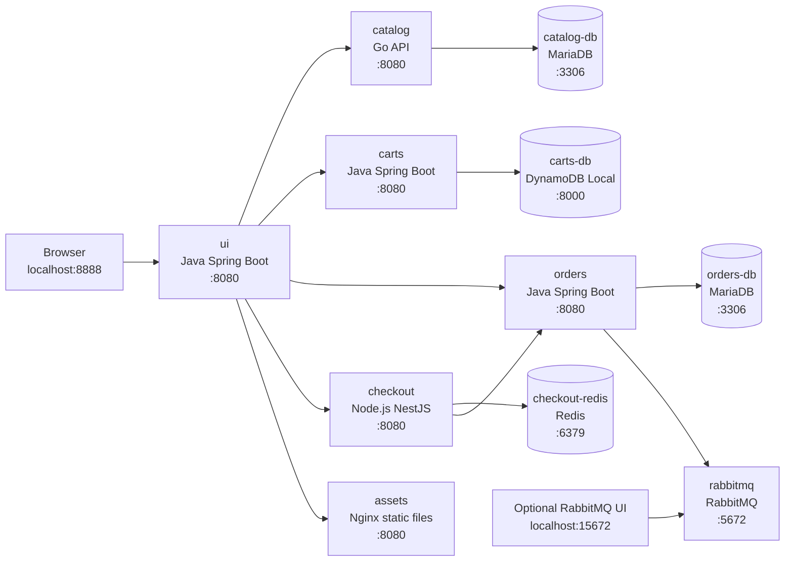
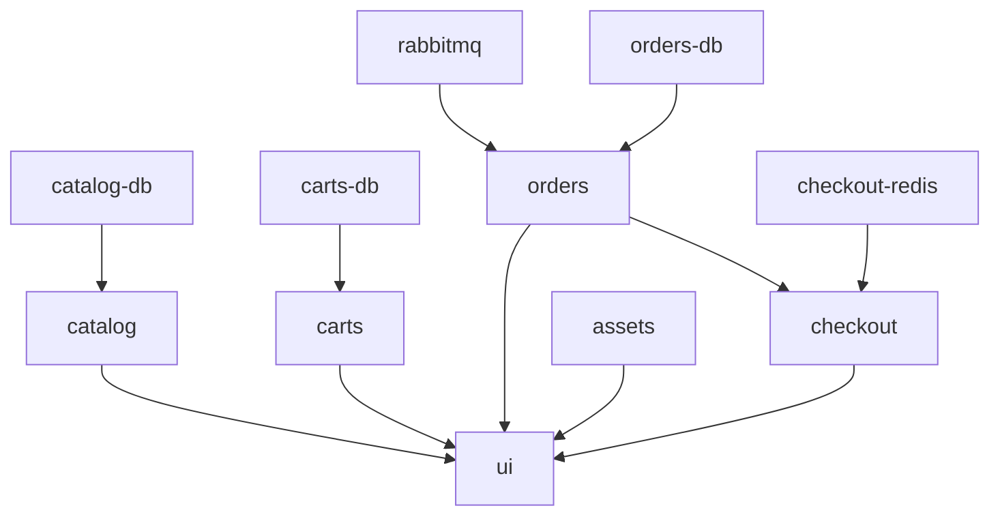

# Student Project: Deploy the Retail Store Application with Docker Compose

## Project Goal

Your task is to containerize and deploy the AWS Containers Retail Sample application locally using Docker Compose.

You are given the application source code repository, but you are not given a completed `docker-compose.yml` file. You must study the service source folders, build the required Docker images, define the service dependencies, configure the correct environment variables, and run the full application stack on your machine.

At the end of the project, the retail store frontend must be available at:

```text
http://localhost:8888
```

## Application Overview

The application is a microservices-based retail store. It contains a frontend UI, backend API services, static assets, and several backing services for persistence and messaging.

| Service | Purpose | Language / Runtime | Internal Port |
|---|---|---:|---:|
| `ui` | Web frontend and backend aggregator | Java 17 / Spring Boot | `8080` |
| `catalog` | Product catalog API | Go | `8080` |
| `carts` | Shopping cart API | Java 17 / Spring Boot | `8080` |
| `orders` | Orders API | Java 17 / Spring Boot | `8080` |
| `checkout` | Checkout orchestration API | Node.js / NestJS | `8080` |
| `assets` | Static product image and CSS assets | Nginx | `8080` |
| `catalog-db` | Catalog database | MariaDB | `3306` |
| `orders-db` | Orders database | MariaDB | `3306` |
| `carts-db` | Cart database | DynamoDB Local | `8000` |
| `checkout-redis` | Checkout session store | Redis | `6379` |
| `rabbitmq` | Orders messaging broker | RabbitMQ | `5672`, `15672` |

## Service Diagram

The diagram below shows the main runtime architecture. The browser only connects to the `ui` service through the host port `8888`. All other application calls happen inside the Docker Compose network.



## Dependency Graph

Use this graph to reason about `depends_on`, startup order, health checks, and restart behavior.



## Required Deliverables

Submit the following:

1. A working `docker-compose.yml` file created by you.
2. Any Dockerfiles you create or modify.
3. A short `DEPLOYMENT_NOTES.md` explaining:
   - how to build the images,
   - how to start the application,
   - how to stop and remove the containers,
   - which URL to open in the browser,
   - any problems you encountered and how you solved them.
4. Screenshots or terminal output showing:
   - `docker compose ps`,
   - successful access to `http://localhost:8888`,
   - successful access to `http://localhost:8888/catalog`.

## Important Rule

Do not use prebuilt application images for the main application services.

You must build these services from the source code in this repository:

```text
ui
catalog
carts
orders
checkout
assets
```

You may use public images for the backing services:

```text
mariadb:10.9
amazon/dynamodb-local:1.20.0
redis:6-alpine
rabbitmq:3-management
```

## Docker Image Build Requirements

The repository already contains reusable Dockerfiles for several runtimes. Use the correct build context and build arguments for each service.

| Service | Build Context | Dockerfile | Required Build Argument |
|---|---|---|---|
| `ui` | `src/ui` | `images/java17/Dockerfile` | `JAR_PATH=target/ui-0.0.1-SNAPSHOT.jar` |
| `catalog` | `src/catalog` | `images/go/Dockerfile` | `MAIN_PATH=main.go` |
| `carts` | `src/cart` | `images/java17/Dockerfile` | `JAR_PATH=target/carts-0.0.1-SNAPSHOT.jar` |
| `orders` | `src/orders` | `images/java17/Dockerfile` | `JAR_PATH=target/orders-0.0.1-SNAPSHOT.jar` |
| `checkout` | `src/checkout` | `images/nodejs/Dockerfile` | none |
| `assets` | `src/assets` | `src/assets/Dockerfile` | none |

You may choose your own local image names, but they should be clear and consistent. Example naming pattern:

```text
retail-store-ui:local
retail-store-catalog:local
retail-store-carts:local
retail-store-orders:local
retail-store-checkout:local
retail-store-assets:local
```

## Required Network Names

Your services must be able to reach one another by Docker Compose service name. Use these service names because the application environment variables below depend on them:

```text
ui
catalog
carts
orders
checkout
assets
catalog-db
orders-db
carts-db
checkout-redis
rabbitmq
```

## Port Publishing Requirements

Only the services that need browser or host access should publish ports to your machine.

| Service | Host Port | Container Port | Purpose |
|---|---:|---:|---|
| `ui` | `8888` | `8080` | Retail store frontend |
| `rabbitmq` | `15672` | `15672` | RabbitMQ management UI, optional |
| `rabbitmq` | `5672` | `5672` | RabbitMQ broker, optional host access |

The other services can stay internal to the Compose network.

## Shared Variable

Use one shared database password variable for MariaDB-backed services:

```text
MYSQL_PASSWORD=choose-a-local-password
```

You may place it in a `.env` file or pass it from the shell when running Docker Compose.

Example `.env` content:

```text
MYSQL_PASSWORD=store-local-pass
```

Do not commit real production secrets.

## Service Environment Variables

### `ui`

The UI service aggregates calls to the backend APIs.

| Variable | Required Value |
|---|---|
| `JAVA_OPTS` | `-XX:MaxRAMPercentage=75.0 -Djava.security.egd=file:/dev/urandom` |
| `SERVER_TOMCAT_ACCESSLOG_ENABLED` | `true` |
| `ENDPOINTS_CATALOG` | `http://catalog:8080` |
| `ENDPOINTS_CARTS` | `http://carts:8080` |
| `ENDPOINTS_ORDERS` | `http://orders:8080` |
| `ENDPOINTS_CHECKOUT` | `http://checkout:8080` |
| `ENDPOINTS_ASSETS` | `http://assets:8080` |

Optional variables:

| Variable | Default | Description |
|---|---|---|
| `PORT` | `8080` | Internal server port |
| `ENDPOINTS_HTTP_KEEPALIVE` | `true` | Backend HTTP keepalive setting |
| `RETAIL_UI_BANNER` | empty | Banner text shown at top of UI |

### `catalog`

The catalog service connects to MariaDB.

| Variable | Required Value |
|---|---|
| `GIN_MODE` | `release` |
| `DB_ENDPOINT` | `catalog-db:3306` |
| `DB_NAME` | `sampledb` |
| `DB_USER` | `catalog_user` |
| `DB_PASSWORD` | `${MYSQL_PASSWORD}` |
| `DB_MIGRATE` | `true` |

Optional variables:

| Variable | Default | Description |
|---|---|---|
| `PORT` | `8080` | Internal server port |
| `DB_READ_ENDPOINT` | empty | Optional read database endpoint |
| `DB_CONNECT_TIMEOUT` | `5` | Database connection timeout in seconds |

### `catalog-db`

Use image:

```text
mariadb:10.9
```

| Variable | Required Value |
|---|---|
| `MYSQL_ROOT_PASSWORD` | `${MYSQL_PASSWORD}` |
| `MYSQL_DATABASE` | `sampledb` |
| `MYSQL_USER` | `catalog_user` |
| `MYSQL_PASSWORD` | `${MYSQL_PASSWORD}` |

### `carts`

The carts service uses DynamoDB Local.

| Variable | Required Value |
|---|---|
| `JAVA_OPTS` | `-XX:MaxRAMPercentage=75.0 -Djava.security.egd=file:/dev/urandom` |
| `SERVER_TOMCAT_ACCESSLOG_ENABLED` | `true` |
| `SPRING_PROFILES_ACTIVE` | `dynamodb` |
| `CARTS_DYNAMODB_ENDPOINT` | `http://carts-db:8000` |
| `CARTS_DYNAMODB_CREATETABLE` | `true` |
| `AWS_ACCESS_KEY_ID` | `key` |
| `AWS_SECRET_ACCESS_KEY` | `dummy` |

Optional variables:

| Variable | Default | Description |
|---|---|---|
| `PORT` | `8080` | Internal server port |
| `CARTS_DYNAMODB_TABLENAME` | `Items` | DynamoDB table name |

### `carts-db`

Use image:

```text
amazon/dynamodb-local:1.20.0
```

No environment variables are required for the basic local deployment.

### `orders`

The orders service uses MariaDB and RabbitMQ.

| Variable | Required Value |
|---|---|
| `JAVA_OPTS` | `-XX:MaxRAMPercentage=75.0 -Djava.security.egd=file:/dev/urandom` |
| `SERVER_TOMCAT_ACCESSLOG_ENABLED` | `true` |
| `SPRING_PROFILES_ACTIVE` | `mysql,rabbitmq` |
| `SPRING_DATASOURCE_WRITER_URL` | `jdbc:mariadb://orders-db:3306/orders` |
| `SPRING_DATASOURCE_WRITER_USERNAME` | `orders_user` |
| `SPRING_DATASOURCE_WRITER_PASSWORD` | `${MYSQL_PASSWORD}` |
| `SPRING_DATASOURCE_READER_URL` | `jdbc:mariadb://orders-db:3306/orders` |
| `SPRING_DATASOURCE_READER_USERNAME` | `orders_user` |
| `SPRING_DATASOURCE_READER_PASSWORD` | `${MYSQL_PASSWORD}` |
| `SPRING_RABBITMQ_HOST` | `rabbitmq` |

Optional variables:

| Variable | Default | Description |
|---|---|---|
| `PORT` | `8080` | Internal server port |

### `orders-db`

Use image:

```text
mariadb:10.9
```

| Variable | Required Value |
|---|---|
| `MYSQL_ROOT_PASSWORD` | `${MYSQL_PASSWORD}` |
| `MYSQL_DATABASE` | `orders` |
| `MYSQL_USER` | `orders_user` |
| `MYSQL_PASSWORD` | `${MYSQL_PASSWORD}` |

### `checkout`

The checkout service uses Redis and calls the orders service.

| Variable | Required Value |
|---|---|
| `REDIS_URL` | `redis://checkout-redis:6379` |
| `ENDPOINTS_ORDERS` | `http://orders:8080` |

Optional variables:

| Variable | Default | Description |
|---|---|---|
| `PORT` | `8080` | Internal server port |
| `REDIS_READER_URL` | empty | Optional read Redis endpoint |

### `checkout-redis`

Use image:

```text
redis:6-alpine
```

No environment variables are required for the basic local deployment.

### `assets`

The assets service serves static files through Nginx.

| Variable | Required Value |
|---|---|
| `PORT` | `8080` |

### `rabbitmq`

Use image:

```text
rabbitmq:3-management
```

No environment variables are required for the basic local deployment.

The management UI is available on port `15672` if you publish it. The default local RabbitMQ credentials for this image are usually:

```text
guest / guest
```

## Suggested Startup Order

Docker Compose can start services together, but your application services depend on databases and message brokers. Configure dependencies thoughtfully.

Recommended dependency relationships:

| Service | Depends On |
|---|---|
| `catalog` | `catalog-db` |
| `carts` | `carts-db` |
| `orders` | `orders-db`, `rabbitmq` |
| `checkout` | `checkout-redis`, `orders` |
| `ui` | `catalog`, `carts`, `orders`, `checkout`, `assets` |

Some services may start before databases are fully ready. Your solution should tolerate this by allowing containers to restart, using health checks, or both.

## Validation Checklist

After starting the stack, run:

```bash
docker compose ps
```

All services should be running.

Then test the UI:

```bash
curl -L http://localhost:8888/
curl -L http://localhost:8888/catalog
curl -L http://localhost:8888/cart
```

Expected result:

```text
HTTP 200 responses after redirects
```

You should also open this URL in a browser:

```text
http://localhost:8888
```

The homepage should show retail products. The catalog page should list products. The cart page should load successfully.

## Troubleshooting Hints

If the UI loads but products do not appear, check:

```bash
docker compose logs catalog
docker compose logs catalog-db
```

If cart actions fail, check:

```bash
docker compose logs carts
docker compose logs carts-db
```

If checkout fails, check:

```bash
docker compose logs checkout
docker compose logs orders
docker compose logs rabbitmq
```

If a Java service exits immediately, verify:

```text
SPRING_PROFILES_ACTIVE
database URL
database username
database password
RabbitMQ host
```

If a service cannot reach another service, verify that:

1. The service names match the names listed in this document.
2. The services are on the same Docker Compose network.
3. You are using internal container ports, not host ports, for service-to-service communication.

For example, the UI should call:

```text
http://catalog:8080
```

not:

```text
http://localhost:8080
```

Inside Docker Compose, `localhost` means the current container, not your laptop.

## Grading Criteria

| Area | Points |
|---|---:|
| Correct Docker images built from source | 20 |
| Correct Compose service definitions | 20 |
| Correct environment variables | 20 |
| Correct service dependencies and networking | 15 |
| Application works in browser on port `8888` | 15 |
| Clear deployment notes and evidence | 10 |

## Instructor Note

Before sharing the repository with students, make sure completed Compose solutions are not included in the student branch. In particular, remove or hide any existing `docker-compose.yml` files that already solve the deployment.

The students should receive the source code, Dockerfiles, and this project document, but not a finished Compose file.
